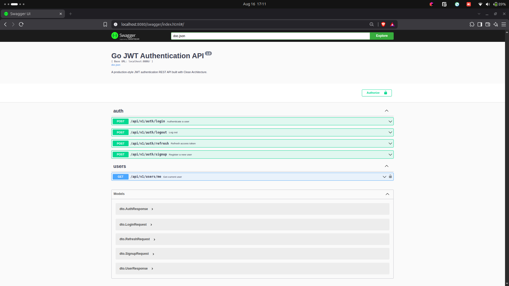
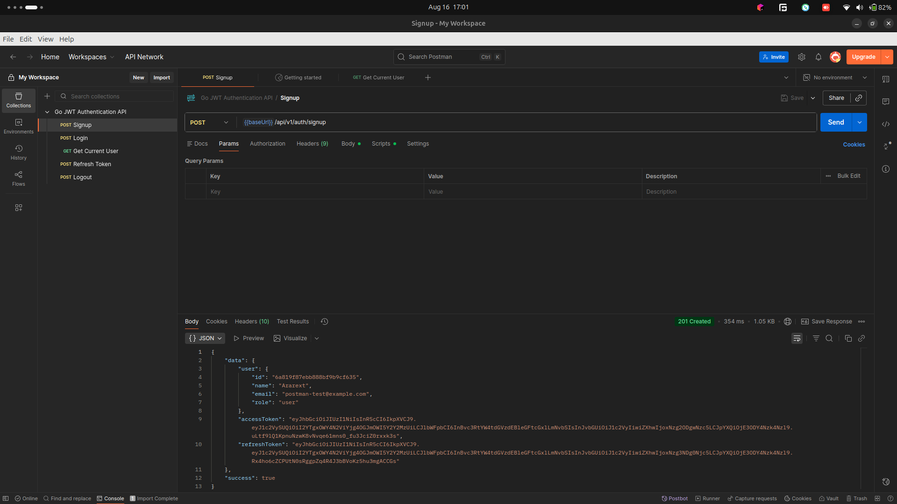

# Go JWT Authentication API

A production-style JWT authentication REST API built in Go, following Clean Architecture principles. This project is built incrementally with a focus on testability, security, and idiomatic Go — not a copy-paste tutorial.

> **Status: Feature-complete.** Core JWT authentication, protected routes, security middleware, Docker, Swagger docs, CI, and a full test suite are all in place. See Roadmap below for planned extensions.

## Tech Stack

| Concern | Choice |
|---|---|
| Language | Go 1.25+ |
| Web framework | [Gin](https://github.com/gin-gonic/gin) |
| Database | MongoDB |
| Auth | JWT (access + refresh tokens) |
| Password hashing | bcrypt |
| Config | godotenv |
| Validation | validator/v10 |
| Logging | zap (structured JSON) |
| Testing | Go testing + testify |

## Architecture

The project follows Clean Architecture — each layer only knows about the layer directly beneath it, and only through interfaces:

```
Handler  →  Service  →  Repository  →  MongoDB
(HTTP)      (business     (interface,
             logic)        no HTTP knowledge)
```

- **Handlers** parse HTTP requests and format responses — no business logic.
- **Services** contain business rules (e.g. "reject signup if email already exists").
- **Repositories** are defined as interfaces and talk to MongoDB — this is what allows services to be unit tested with a fake repository instead of a real database.

```
cmd/server/         entrypoint, server wiring
internal/
  config/            typed environment configuration
  database/          MongoDB connection + index setup
  models/            database-shape structs (never exposed via API)
  dto/               request/response shapes with validation tags
  repository/        UserRepository interface + MongoDB implementation
  service/           business logic — Signup, Login, RefreshToken, unit tested
  handler/           HTTP handlers — auth (signup/login/refresh/logout) and users/me
  middleware/         JWT auth, CORS, secure headers, rate limiting
  utils/             bcrypt hashing, JWT utils, validation helper, response helper
  routes/            route registration (/api/v1/auth/*, /api/v1/users/*)
  logger/            zap logger initialization
pkg/
tests/
docs/
```

## Progress

- [x] Project skeleton, typed config loading, structured logging
- [x] MongoDB connection with startup ping + unique email index
- [x] `User` model and `UserRepository` (interface + MongoDB implementation)
- [x] bcrypt password hashing utilities, unit tested
- [x] Request/response DTOs with `validator/v10` tags
- [x] Centralized struct validation helper with readable error messages
- [x] JWT access/refresh token generation and validation, unit tested (round-trip, expiry, tampering, wrong secret)
- [x] Auth service (signup / login business logic), unit tested against a mock repository (no real database needed)
- [x] HTTP handlers and routes (`/api/v1/auth/signup`, `/api/v1/auth/login`) — fully wired end-to-end against real MongoDB
- [x] JWT middleware and protected routes (`/api/v1/users/me`, refresh, logout scaffold)
- [x] Rate limiting, CORS, secure headers, graceful shutdown
- [x] Docker + docker-compose (one-command startup: `docker compose up --build`)
- [x] Swagger/OpenAPI docs (interactive UI at `/swagger/index.html`)
- [x] GitHub Actions CI (build, test, lint on every push)
- [x] Postman collection (`docs/postman_collection.json`, with automatic token capture)

## Setup

### Prerequisites
- Go 1.25+
- Docker (for running MongoDB locally, or the full stack via docker-compose)

### Option 1: Run everything with Docker Compose (recommended)

```bash
git clone https://github.com/ararext/Go-JWT-Authentication-API.git
cd Go-JWT-Authentication-API
export JWT_SECRET=your-real-random-secret
docker compose up --build
```

This starts both the API and MongoDB together. Verify:

```bash
curl http://localhost:8080/health
# {"status":"ok"}
```

### Option 2: Run the API locally, MongoDB in Docker

```bash
git clone https://github.com/ararext/Go-JWT-Authentication-API.git
cd Go-JWT-Authentication-API
go mod tidy

docker run -d --name mongo-dev --restart unless-stopped -p 27017:27017 mongo:7
```

Create a `.env` file in the project root:

```env
PORT=8080
MONGODB_URI=mongodb://localhost:27017
DATABASE_NAME=jwt_auth
JWT_SECRET=change-this-to-something-random
ACCESS_TOKEN_DURATION=15m
REFRESH_TOKEN_DURATION=168h
```

Run:

```bash
go run cmd/server/main.go
```

Verify:

```bash
curl http://localhost:8080/health
# {"status":"ok"}
```

## API Documentation

Interactive Swagger UI, with every endpoint documented and testable in-browser:

```
http://localhost:8080/swagger/index.html
```



## API Endpoints

All routes are prefixed with `/api/v1`.

| Method | Endpoint | Description | Auth required |
|---|---|---|---|
| POST | `/auth/signup` | Register a new user, returns access + refresh tokens | No |
| POST | `/auth/login` | Authenticate, returns access + refresh tokens | No |
| POST | `/auth/refresh` | Exchange a valid refresh token for a new access token | No (requires refresh token in body) |
| POST | `/auth/logout` | Client-side logout (stateless for now — see Roadmap) | No |
| GET | `/users/me` | Return the currently authenticated user | Yes (`Authorization: Bearer <accessToken>`) |

**Example — Signup**

```bash
curl -X POST http://localhost:8080/api/v1/auth/signup \
  -H "Content-Type: application/json" \
  -d '{"name":"Ararext","email":"ararext@example.com","password":"securepass123"}'
```

**Example — Login**

```bash
curl -X POST http://localhost:8080/api/v1/auth/login \
  -H "Content-Type: application/json" \
  -d '{"email":"ararext@example.com","password":"securepass123"}'
```

**Example — Accessing a protected route**

```bash
curl http://localhost:8080/api/v1/users/me \
  -H "Authorization: Bearer <accessToken>"
```

All error responses follow a consistent shape:

```json
{ "success": false, "message": "invalid credentials" }
```



### Postman Collection

A ready-to-import collection covering every endpoint lives at [`docs/postman_collection.json`](docs/postman_collection.json). It automatically captures the access/refresh tokens from Signup, Login, and Refresh responses into collection variables, so "Get Current User" works immediately afterward with no manual copy-pasting.

**Import → File → `docs/postman_collection.json`**

## Testing

```bash
make test
# or: go test ./... -v -cover
```

Current coverage: `internal/utils` 80.6%, `internal/service` 63.9%, plus a full HTTP-layer integration suite in `tests/` covering signup, login, and protected-route access (via `httptest` and an in-memory mock repository — no real database required).

Coverage currently covers:
- Password hashing (bcrypt round-trip, salting verification)
- Struct validation (valid input, weak password, invalid email)
- JWT generation and validation (valid round-trip, expired tokens, malformed tokens, wrong signing secret, tampered signatures)
- AuthService signup/login logic — tested against an in-memory mock repository, no real database required (successful signup, duplicate email rejection, successful login, wrong password, unknown user)
- JWT middleware — protected route rejects missing and malformed tokens (`tests/` package, using `httptest`)

## Environment Variables

| Variable | Description | Example |
|---|---|---|
| `PORT` | Server port | `8080` |
| `MONGODB_URI` | MongoDB connection string | `mongodb://localhost:27017` |
| `DATABASE_NAME` | Database name | `jwt_auth` |
| `JWT_SECRET` | Secret used to sign JWTs — never commit a real value | — |
| `ACCESS_TOKEN_DURATION` | Access token lifetime | `15m` |
| `REFRESH_TOKEN_DURATION` | Refresh token lifetime | `168h` |

## Makefile Commands

| Command | Description |
|---|---|
| `make run` | Run the server locally |
| `make test` | Run all tests with coverage |
| `make fmt` | Format code with `gofmt` |
| `make lint` | Run `golangci-lint` |
| `make swagger` | Regenerate Swagger docs |
| `make docker` | Build and run the full stack via Docker Compose |
| `make clean` | Remove generated docs and build artifacts |

## CI

Every push and pull request to `main` triggers a GitHub Actions workflow that builds the project, runs the full test suite, and lints the code. See `.github/workflows/ci.yml`.

## Roadmap

With the core auth API complete, planned extensions include: email verification (OTP), password reset, role-based access control (admin/user), refresh token rotation, a Redis-backed token blacklist (the `TokenBlacklist` interface already exists in `internal/service`, unimplemented), Prometheus metrics, and optional Kubernetes deployment manifests.

## License

MIT — see [LICENSE](LICENSE).